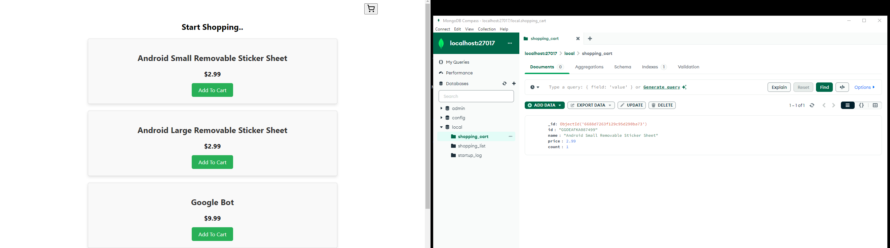
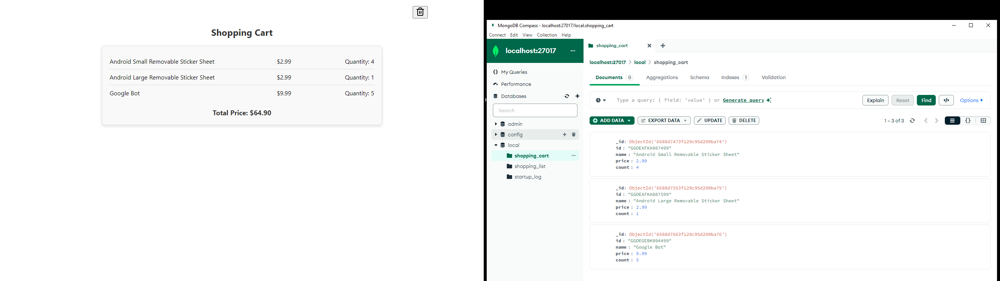

# Shopping Cart

Entry project to MERN Stack

## About

- **Main Language:** Typescript with ES6
- **State Management:** Zustand.
- **Used:** WebPack for bundling, Docker for Packaging, MongoDB compass for GUI
- **Listening at:** HOST: localhost PORT: 3000 

Implemented CRUD operations with maintainable project structure for easy future development and scaling.


## Screenshots





## Installation

Run the following command in your terminal:
###### Install Project Dependencies:

```bash
  npm install
```
###### Start the server:
```bash
  npm run dev:server 
```
###### Web Pack Bundling:

```bash
  npm run dev:bundler
```


